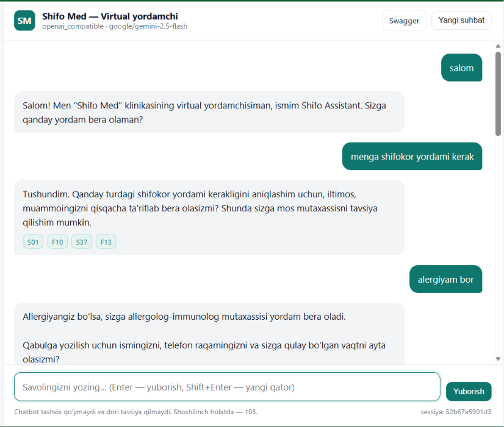
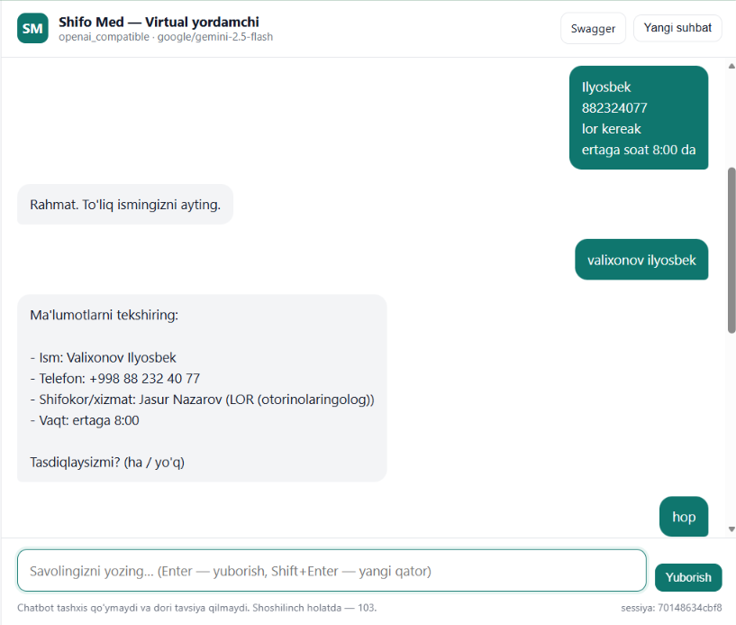
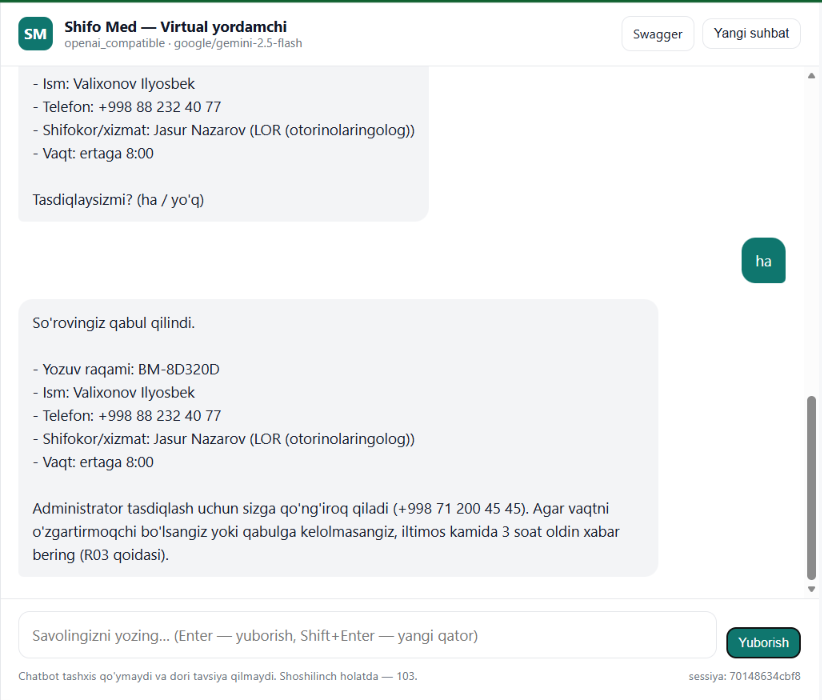

# Hospital Chatbot — "Shifo Med" klinikasi uchun AI chatbot

Klinika haqidagi savollarga javob beradigan, mos shifokorga yo'naltiradigan va qabulga
yozilish uchun ma'lumot yig'adigan chatbot. Javoblar faqat `data/` papkasidagi bilim
bazasidan olinadi — model o'ylab topgan narx, shifokor yoki dori kod darajasida ushlanadi.

**Stack:** Python · FastAPI · RAG (BM25) · LLM API (OpenRouter / OpenAI / DeepSeek / Ollama)



Web chat — savol-javob, manba ID lari va xavfsizlik belgilari bilan.

---

## 1. Talablar

- Python 3.11 yoki yuqori
- Internet (API model uchun) va LLM API kaliti (masalan [OpenRouter](https://openrouter.ai/keys))
- Git (repo'ni klonlash uchun)

---

## 2. O'rnatish (qadam-baqadam)

**1)** Loyihani oling va papkaga kiring:

```bash
git clone <repo-url>
cd hospital-chatbot
```

**2)** Virtual muhit yaratib, yoqing:

```bat
python -m venv .venv
.venv\Scripts\activate          :: Windows (PowerShell yoki cmd)
```

```bash
python3 -m venv .venv           # Linux / macOS
source .venv/bin/activate
```

Yoqilgach buyruq qatori boshida `(.venv)` ko'rinadi.

**3)** Kutubxonalarni o'rnating:

```bash
pip install -r requirements.txt
```

**4)** Sozlamalar faylini yarating:

```bash
copy .env.example .env           # Windows
cp .env.example .env             # Linux / macOS
```

**5)** `.env` faylini ochib, API kalitni yozing:

```env
LLM_PROVIDER=openai_compatible
OPENAI_API_KEY=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        # kalitni https://openrouter.ai/keys dan olasiz
OPENAI_BASE_URL=https://openrouter.ai/api/v1
LLM_MODEL=google/gemini-2.5-flash
```

> Kalit faqat `.env` faylida saqlanadi (u `.gitignore` da). Kodda yoki repoda kalit
> bo'lmasligi kerak. OpenAI / DeepSeek variantlari `.env.example` oxirida keltirilgan.

**6)** Test ma'lumotlarini yarating (ixtiyoriy — fayllar repoda ham bor):

```bash
python scripts/generate_data.py
```

Tayyor: 12 shifokor, 31 xizmat, 14 qoida, 15 FAQ.

---

## 3. Ishga tushirish

```bash
uvicorn app.main:app --reload --port 8000
```

Terminalda `Application startup complete.` chiqsa — server ishlayapti. Bu oynani yopmang.

---

## 4. Qanday ishlatiladi

| Manzil | Nima qilinadi |
|---|---|
| **http://127.0.0.1:8000/** | **Web chat** — savol yozing va javob oling |
| **http://127.0.0.1:8000/docs** | **Swagger** — API hujjati, "Try it out" bilan sinov, tayyor misollar |
| http://127.0.0.1:8000/health | Holat tekshiruvi: `"status": "ok"` bo'lishi kerak |
| http://127.0.0.1:8000/redoc | ReDoc ko'rinishi |

**Web chatda sinab ko'rish uchun savollar:**

```
Klinika qayerda joylashgan?
Kardiolog qabuli qancha turadi?
Tishim og'riyapti
Qabulga yozilmoqchiman
```

### Qabulga yozilish jarayoni (namuna)

Chatbot ma'lumotlarni birma-bir so'raydi, oxirida hammasini ko'rsatib tasdiqlatadi:

**1-qadam** — ism, telefon, shifokor va qulay vaqt yig'iladi, so'ng tekshirish uchun ko'rsatiladi:



**2-qadam** — tasdiqlangandan keyin yozuv raqami beriladi va administrator qo'ng'iroq qilishi aytiladi:



> Administrator tasdiqlagunga qadar yozuv `data/bookings.jsonl` faylida saqlanadi.

**API orqali so'rov:**

```bash
curl -X POST http://127.0.0.1:8000/chat \
  -H "Content-Type: application/json" \
  -d '{"message": "Kardiolog qabuli qancha turadi?"}'
```

Javob:

```json
{
  "session_id": "9f2c1a7b4e10",
  "reply": "Kardiolog Aziz Karimovning konsultatsiyasi 250 000 so'm turadi [D01].",
  "intent": "doctors",
  "sources": [{"id": "D01", "type": "doctor", "title": "Aziz Karimov (Kardiolog)", "score": 9.15}],
  "safety": {"emergency": false, "refused_medical_advice": false, "grounding_violation": false},
  "model": "openai_compatible:google/gemini-2.5-flash",
  "latency_ms": 663
}
```

**Suhbat kontekstini saqlash** — javobdagi `session_id` ni keyingi so'rovda yuboring:

```bash
curl -X POST http://127.0.0.1:8000/chat \
  -H "Content-Type: application/json" \
  -d '{"message": "Uning qabul kunlari qanday?", "session_id": "9f2c1a7b4e10"}'
```

Kontekstni tozalash: `curl -X POST "http://127.0.0.1:8000/chat/reset?session_id=..."`

**Serverni to'xtatish:** ishlab turgan oynada `Ctrl + C`.

---

## 5. Modelni almashtirish

Model nomi `.env` da — kodni o'zgartirish shart emas, serverni qayta ishga tushirish kifoya.

| Provayder | `.env` sozlamalari |
|---|---|
| **OpenRouter** (tavsiya) | `OPENAI_BASE_URL=https://openrouter.ai/api/v1` · `LLM_MODEL=google/gemini-2.5-flash` |
| OpenAI | `OPENAI_BASE_URL=https://api.openai.com/v1` · `LLM_MODEL=gpt-4o-mini` |
| DeepSeek | `OPENAI_BASE_URL=https://api.deepseek.com/v1` · `LLM_MODEL=deepseek-chat` |
| Lokal Ollama (internetsiz, sifati pastroq) | `LLM_PROVIDER=ollama` · `LLM_MODEL=qwen3:1.7b` |

---

## 6. Testlar

```bash
python -m pytest tests/ -q          # 67 test — API kalit talab qilmaydi
```

Haqiqiy model bilan uchdan-uchiga tekshiruv (server ishlab turishi kerak):

```bash
python scripts/smoke_test.py        # 12 senariy: narx, shifokor, shoshilinch, injection, qabul
```

---

## 7. Loyiha tuzilishi

```
data/                      # Bilim bazasi (yagona ma'lumot manbai)
├── doctors.json           # 12 shifokor: ixtisoslik, ish vaqti, narx
├── services.json          # 31 xizmat va narxlar
├── rules.json             # 14 klinika qoidasi
└── faqs.json              # 15 FAQ + klinika ma'lumoti

app/
├── main.py                # FastAPI ilova, /health, /info, statik fayllar
├── api/chat.py            # POST /chat, qabulga yozilish, orkestratsiya
├── services/rag_service.py   # Qidiruv: JSON -> BM25 + sinonimlar
├── services/llm_service.py   # System prompt, xavfsizlik, grounding, provayderlar
├── models/schemas.py      # Pydantic modellari
└── static/index.html      # Web chat interfeysi

scripts/generate_data.py   # Bilim bazasini qayta yaratish
scripts/smoke_test.py      # E2E tekshiruv
tests/test_chat.py          # 67 test
```

---

## 8. Ko'proq ma'lumot

- **[docs/ARXITEKTURA.md](docs/ARXITEKTURA.md)** — arxitektura, talablar qanday ta'minlangan,
  yondashuv sabablari, cheklovlar
- **[docs/MUAMMOLAR.md](docs/MUAMMOLAR.md)** — xatolar va yechimlar jadvali
- **[AGENTS.md](AGENTS.md)** — AI agentlar uchun loyiha qoidalari
